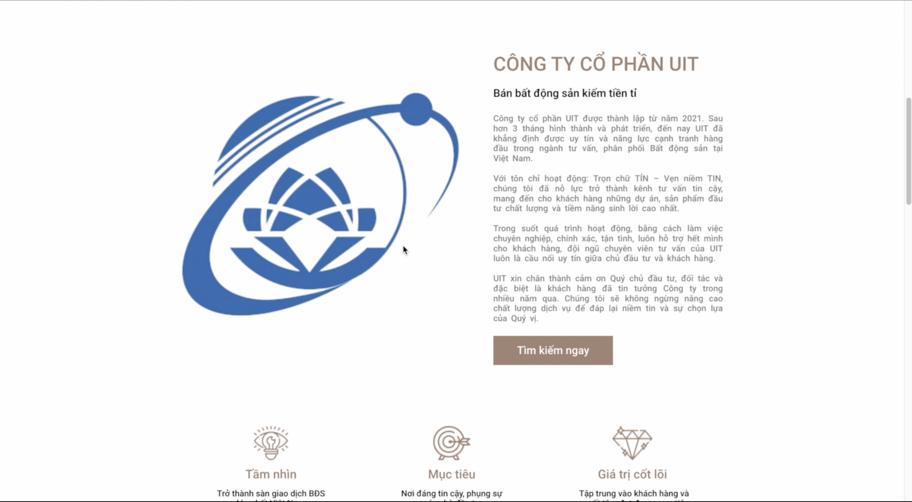

# Real Estate Business System


## Table of Contents
* [Introduction](#introduction)
* [Video Demo](#video-demo)
* [Technologies Used](#technologies-used)
* [Features](#features)
* [Deployment](#deployment)
* [How to install and run the project](#how-to-install-and-run-the-project)
* [Usage](#usage)
* [Acknowledgements](#acknowledgements)
* [AIT Team](#ait-team)
* [License](#license)

<!-- * [License](#license) -->


## Introduction
Building a web Real Estate Business System to serve the needs of online Real Estate Business to serve individuals and organizations working in the real estate industry that need to use the online business system to market approach, search for rich customer files on the internet platform. \
This is the [Software Requirements Document](https://docs.google.com/document/d/1BtMyjG6AKyCOPqctpCbN3TaV8CHAYukO/edit?usp=sharing&ouid=116992013396456829835&rtpof=true&sd=true)


</br>

</br>



## Video Demo
You can have a look with Real Estate Business System through [the video](https://drive.google.com/file/d/14MWFZyD9VfW3nRQdY3ZghHX1KU8prToW/view?usp=sharing).


## Technologies Used
Real Estate Business System should use the following technologies, frameworks and development techniques:
- Backend - [NodeJs](https://nodejs.org/en/)
- Frontend - [ReactJs](https://reactjs.org/)
- Database - [MongoDB](https://www.mongodb.com/)
- Project Management - [Azure DevOps](https://azure.microsoft.com/en-us/services/devops/)
- PaaS – Platform as a service - [Heroku](https://www.heroku.com/)


## Features
A few of the things you can do with Real Estate Business System:
- Log in
- Registration
- Change Password
- Forgot password
- Post news
- Post list
- Search post
- News management
- Referral information management
- Personal information management


## Deployment
Web is deploying at [here](https://www.housev.com.vn/user).\
If the link does not response, please run the project on your localhost.


## How to install and run the project

To clone and run this application, you'll need [Npm - package manager](https://www.npmjs.com/), [NodeJs](https://nodejs.org/en/), [Visual Studio Code](https://code.visualstudio.com/) installed on your computer. 


1. Run server
- `cd backend` 
- `npm i`
- `npm run dev`

2. Run client
- `cd front-end` 
- `npm i`
- `npm run start`

```
The client is listening at port 3000
The server is listening at port 5000 
```

## Acknowledgements
- Thanks to [NodeJs](https://nodejs.org/en/) for supporting us with NodeJS document
- Thanks to [Npm - package manager](https://www.npmjs.com/) for supporting us to use library community
- Thanks to [Stackoverflow](https://stackoverflow.com/) for supporting us 
- Thanks to [Github](https://github.com/) for supporting us control application's versions 

## Development Team
- The project is final result of SE347.M11.PMCL - UIT class with 50 members. 
- Development Team is given a huge support of Phan Trung Hieu - Chairman of [GSoft](https://gsoft.com.vn/trang-chu/)


## 📝 License

Copyright © 2021 [Thang Phu Phat](https://github.com/LucasTran-tq). <br />
This project is [MIT](https://github.com/LucasTran-tq/Business-Management-AspNet/blob/main/LICENSE) licensed.